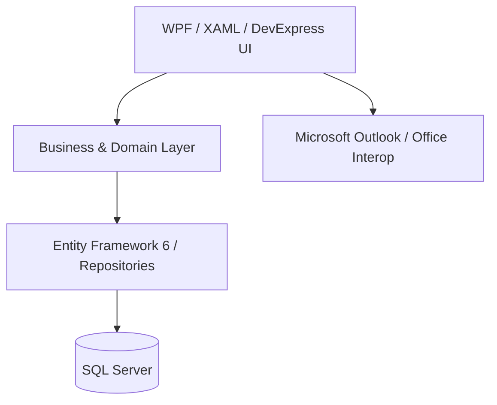

# SmartERP

**Enterprise ERP platform built with C#, WPF, Entity Framework 6, SQL Server and DevExpress.**

SmartERP is a mature desktop ERP codebase covering finance, accounting, procurement, inventory, reporting and internal operations. It represents real-world enterprise application engineering: large domain models, long-lived business rules, data-heavy desktop UI, SQL-backed workflows, third-party integrations and legacy-system modernisation.

> **Portfolio focus:** this repository is presented for technical review by recruiters and engineering teams. Environment-specific credentials and deployment details are intentionally excluded.

## At a Glance

| Area | Implementation |
| --- | --- |
| Language | C# |
| Platform | .NET Framework / WPF |
| UI | XAML, DevExpress WPF |
| Data | SQL Server, Entity Framework 6, LINQ |
| Integrations | Microsoft Outlook / Office Interop |
| Architecture | Desktop presentation layer + business/domain layer + EF data access |
| Domain | ERP, accounting, procurement, inventory, cash flow and reporting |

## Core Business Modules

- Sales Orders and Sales Invoices
- Purchase Orders and Purchase Invoices
- Procurement, Enquiries and Offers
- Accounting and Journal Vouchers
- Chart of Accounts
- Payments and Sales Receipts
- Inventory and Product Management
- Vendor Management
- Cash Flow Management
- VAT workflows
- Loans and Advances
- Cost Sheets
- Financial and Operational Reporting
- Employee, Department and Company Management
- Roles and Permissions
- Notifications and User Tagging
- Microsoft Outlook integration

## Engineering Highlights

### Multi-company ERP domain
The system models companies, departments, employees, vendors, customers, products, financial transactions and operational workflows in a shared ERP ecosystem.

### Finance and cash-flow workflows
SmartERP includes accounting-oriented workflows, cash-flow management and financial reporting designed around day-to-day business operations rather than generic demo data.

### Microsoft Outlook integration
The desktop client integrates Microsoft Outlook through Office Interop so email can participate directly in ERP workflows, including inbox and sent-mail access.

### Enterprise WPF UI
The application contains large, data-heavy WPF screens built with XAML and DevExpress controls for finance, procurement, reporting and administration.

### Entity Framework and SQL Server
The business layer uses Entity Framework 6, LINQ and SQL Server across a substantial relational domain model with repositories, relationships, migrations and business rules.

### Legacy modernisation
The codebase demonstrates the realities of maintaining and evolving a mature enterprise system: defect fixes, schema changes, performance work, maintainability improvements and staged modernisation.

## Architecture



For a deeper walkthrough, see [Architecture Notes](docs/ARCHITECTURE.md).

## Recruiter Code Tour

If you only have a few minutes, these areas are representative of the codebase:

- [Entity Framework database context](ERP_BL/DBContext/DBContextERP.cs)
- [Cash-flow domain model](ERP_BL/CashFlow/CashFlow.cs)
- [Cash-flow reporting repository](ERP_BL/Reports/CashFlowReportRepo.cs)
- [Cash Flow Center UI](ZAS_ERP/CashFlow/Windows/winCashFlowCenter.xaml)
- [Outlook integration entry points](ZAS_ERP/BussinessLogicss/SYSTEM_STATIC.cs)
- [Chart of Accounts administration](ZAS_ERP/ChartofAccounts/Windows/winCOAAdminPanel.xaml.cs)
- [Procurement / Admin Bills repository](ERP_BL/Procurements/AdminBills/AdminBillsRepo.cs)

## Repository Structure

```text
SmartERP/
├── ERP_BL/      # Business/domain entities, repositories and EF data access
├── ZAS_ERP/     # WPF desktop client (legacy project/namespace name retained)
├── MachineAPI/  # Supporting API/service component
├── docs/        # Portfolio-oriented architecture and setup notes
└── README.md
```

### Why is the desktop project still named `ZAS_ERP`?

`ZAS_ERP` is a legacy internal project/namespace name retained to avoid introducing a broad breaking rename into a mature WPF application. The repository and product are presented publicly as **SmartERP**. A full namespace migration would be handled as a separately tested refactor.

## Local Configuration

Credentials are not stored in source control. SQL-authenticated development environments can supply the password through the `SMARTERP_SQL_PASSWORD` environment variable and local connection-string configuration.

See [Local Setup](docs/LOCAL_SETUP.md) for the portfolio-safe setup notes.

## What This Project Demonstrates

- Enterprise C#/.NET development
- WPF and XAML engineering
- Relational domain modelling
- Entity Framework 6 and LINQ
- SQL Server-backed business systems
- Accounting and ERP workflows
- Integration with Microsoft Office / Outlook
- Debugging and maintenance of mature software
- Legacy modernisation and incremental refactoring
- Working with a large, non-trivial codebase

## Portfolio Notes

This public repository is a recruiter-facing representation of a long-running ERP codebase. Sensitive environment details are excluded, and local IDE/build artefacts are ignored. Some UI dependencies, including DevExpress components, may require the appropriate licensed tooling to build the desktop client locally.

## Author

**Talha Javed**  
Software Engineer — C# / .NET / ERP Systems  
London, United Kingdom
