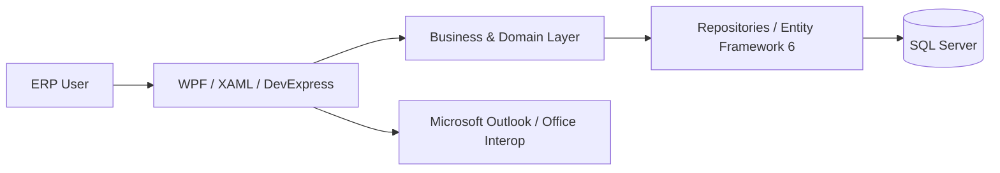

# SmartERP Architecture Notes

This document provides a concise technical map of the SmartERP desktop ERP codebase for engineering review.

## System Shape

SmartERP is a layered .NET Framework desktop application. The WPF client is responsible for interaction-heavy enterprise workflows, while business/domain classes and repositories manage ERP rules and persistence through Entity Framework 6 and SQL Server.

## Main Components

### `ERP_BL`
Contains the business/domain layer and persistence-oriented code, including:

- Entity Framework entities and relationships
- Repository classes
- Database context and migrations
- Finance and accounting models
- Procurement models
- Inventory/product models
- Company, employee and department models
- Reporting data access
- Shared enums and supporting services

### `ZAS_ERP`
Contains the WPF desktop client. The folder retains its legacy namespace/project name because a global namespace rename would require a dedicated regression-tested refactor.

Representative UI areas include:

- Procurement and enquiries
- Sales and purchasing
- Cash-flow management
- Chart of Accounts administration
- Vendor management
- Reporting
- User, role and permission administration
- Outlook-connected workflows

### `MachineAPI`
Supporting service/API component included in the wider solution.

## Data Layer

Entity Framework 6 is used to map a large relational ERP domain onto SQL Server. The model includes relationships between companies, departments, employees, vendors, products, accounting records and operational transactions.

The codebase contains both mature legacy patterns and later repository-oriented implementations. This is typical of a long-running enterprise system that has evolved incrementally rather than being rewritten from scratch.

## Integration Layer

The desktop client integrates with Microsoft Outlook through Office Interop. This allows email to participate in business workflows rather than existing as a separate user activity.

## Modernisation Approach

The safest approach for a mature ERP is incremental modernisation rather than a high-risk big-bang rewrite. Representative modernisation concerns include:

1. Isolating environment-specific configuration and secrets.
2. Reducing coupling between UI and data access.
3. Moving business rules toward testable services.
4. Introducing API boundaries around reusable business capabilities.
5. Migrating selected workflows to a modern web architecture while preserving validated ERP behaviour.

## Engineering Trade-offs

SmartERP demonstrates several realities of production-oriented legacy engineering:

- Backward compatibility can be more important than cosmetic renaming.
- Database relationship changes require careful migration planning.
- Data-heavy desktop UX has different constraints from consumer web UI.
- Business rules accumulated over years must be understood before refactoring.
- Third-party integrations introduce lifecycle, resource-management and deployment concerns.

These trade-offs are part of the value of the project as a software-engineering portfolio piece: the work is not limited to greenfield CRUD implementation.
